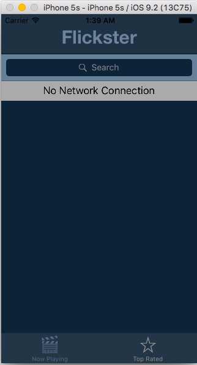

# Flickster_ios
# Project 1 - Flickster

Flickster is a movies app using the [The Movie Database API](http://docs.themoviedb.apiary.io/#).

Time spent: 18 hours spent in total

## User Stories

The following **required** functionality is completed:

- [x] User can view a list of movies currently playing in theaters. Poster images load asynchronously.
    * API call to fetch movies using the Movie Database API
- [x] User can view movie details by tapping on a cell.
    * Standard Navigation controller functionality to segue to movie details view
- [x] User sees loading state while waiting for the API.
    * To prevent any pop ups and cleaner UI I added a progress bar at the top that displays when an API call is in progress
- [x] User sees an error message when there is a network error.
    * When API call returns an error, offline view will display

    
    
- [x] User can pull to refresh the movie list.
    * UIRefreshControl connected to tableView

The following **optional** features are implemented:

- [x] Add a tab bar for **Now Playing** and **Top Rated** movies.
    * implemented a tab bar, tableView will update depending on which tab is selected
- [x] Add a search bar.
    * movies are searchable in either Now Playing or Top Rated tab option
- [x] All images fade in.
    * standard animations functionality to fade images in as they are loading on screen
- [x] Customize the navigation bar.
    * Styling to match color scheme

The following **additional** features are implemented:

- [x] Star ratings
    * I wanted to have an easy visual for users to see the ratings of movies instead of just a rating number.  I utilized [Cosmos CocoaPods](https://github.com/marketplacer/Cosmos) to accomplish this.
- [x] View animations for movie details
    * User can expand/contract overview text in movie details view
## Video Walkthrough

Here's a walkthrough of implemented user stories:

GIF created with [LiceCap](http://www.cockos.com/licecap/).

## Notes

The two biggest challenges were implementing the search bar and implementing a gradient view for the bottom of each cell.  The search bar was difficult to implement since there were lots of variables to consider with the filtered data, and edge cases for when the user clicks the cancel button, the search button, etc.  I also spent a long time with the gradient view and animations for the movie details view since it took me a while to grasp an understanding of CGRect.  Additionally, I spent some time figuring out the dimensions of the poster images in the table view cell and in the details view as to not distort the image yet still maintain an appropriate crop of the poster image in the views.

## License

    Copyright [2016] [Priscilla Lok]

    Licensed under the Apache License, Version 2.0 (the "License");
    you may not use this file except in compliance with the License.
    You may obtain a copy of the License at

        http://www.apache.org/licenses/LICENSE-2.0

    Unless required by applicable law or agreed to in writing, software
    distributed under the License is distributed on an "AS IS" BASIS,
    WITHOUT WARRANTIES OR CONDITIONS OF ANY KIND, either express or implied.
    See the License for the specific language governing permissions and
    limitations under the License.
